# UCP Shopping Agent

A shopping assistant powered by **Upsonic AI Agent** and **UCP (Universal Checkout Protocol)**.

## How it works

```mermaid
flowchart LR
    subgraph User
        A[👤 You]
    end
    
    subgraph Upsonic
        B[🤖 AI Agent]
    end
    
    subgraph UCP
        C[🔌 UCP Tools]
    end
    
    subgraph Merchant
        D[🏪 Shop API]
        E[(📦 Products)]
        F[(🛒 Orders)]
    end
    
    A -->|Chat| B
    B -->|Tool Calls| C
    C -->|API Requests| D
    D --> E
    D --> F
    D -->|Response| C
    C -->|Results| B
    B -->|Answer| A
```



**UCP (Universal Checkout Protocol)** enables AI agents to interact with e-commerce systems through a standardized interface.

| Tool | Description |
|------|-------------|
| `get_available_products()` | Browse product catalog |
| `get_available_discount_codes()` | View discount codes |
| `get_your_user()` | Get user info & addresses |
| `discover_merchant()` | Merchant & payment info |
| `create_cart()` | Create shopping cart |
| `apply_discount()` | Apply discount to cart |
| `set_shipping_address()` | Set delivery address |
| `complete_purchase()` | Complete checkout |

## Installation

```bash
uv venv
uv pip install "ucp-client[server]==0.0.5"
uv pip install upsonic==0.69.3
uv pip install streamlit
```

## Usage

**Terminal 1** - Start the mock server:
```bash
uv run ucp mockup_server
```

**Terminal 2** - Run the agent (CLI):
```bash
uv run upsonic_shopping_agent.py
```

## Streamlit UI

You can also use the Streamlit web interface:

```bash
uv run streamlit run streamlit_app.py
```

Then open http://localhost:8501 in your browser.


